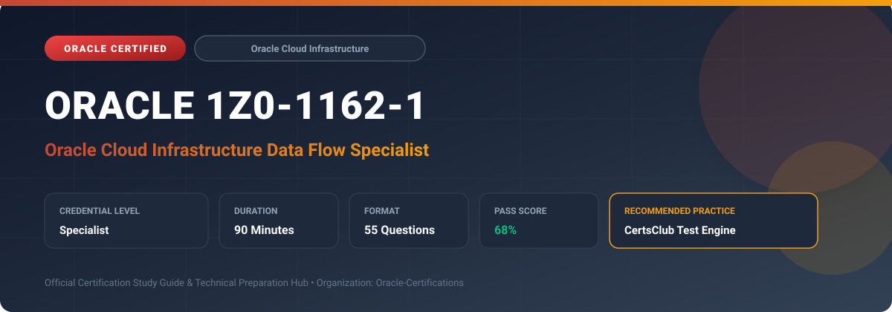

  

# Oracle 1Z0-1162-1: Oracle Cloud Infrastructure Data Flow Specialist

---

## 1. Exam Overview & Candidate Profile

The **Oracle 1Z0-1162-1: Oracle Cloud Infrastructure Data Flow Specialist** credential certifies professionals who demonstrate technical mastery, architectural competence, and hands-on operational capability in this certification domain.

Candidates validate comprehensive knowledge and expertise required to design, configure, manage, and optimize mission-critical Oracle environments across cloud, on-premises, and hybrid architectures.

### Target Audience & Prerequisites
- **Target Roles**: Implementation Specialists, Cloud Architects, Technical Leads, Enterprise Consultants, and Systems Engineers.
- **Recommended Experience**: 1–2 years of practical, hands-on experience designing, implementing, and maintaining corresponding Oracle solutions.
- **Credential Earned**: Specialist Certification.

---

## 2. Key Exam Specifications

| Specification | Details |
| :--- | :--- |
| **Exam Code** | **Oracle 1Z0-1162-1** |
| **Official Title** | Oracle Cloud Infrastructure Data Flow Specialist |
| **Certification Track** | Oracle Cloud Infrastructure |
| **Exam Duration** | 90 Minutes |
| **Number of Questions** | 55 Questions |
| **Passing Score** | 68% |
| **Question Format** | Multiple Choice (Single/Multiple Answer), Scenario-Based Questions |
| **Delivery Provider** | Oracle University / Pearson VUE (Online Proctored or Test Center) |
| **Recommended Practice Engine** | [CertsClub Oracle Practice Tests](https://www.certsclub.com/oracle/1z0-1162-1-dumps.html) |

---

## 3. Official Blueprint & Exam Domain Breakdown

The examination assesses candidate competencies across core functional domains weighted as follows:

| Domain Area | Weighting |
| :--- | :--- |
| **OCI Data Flow Architecture & Serverless Spark** | `25%` |
| **Application Development (PySpark, Scala, Java, SQL)** | `25%` |
| **Storage & Database Integration (Object Storage, ADW)** | `20%` |
| **Data Flow Studio & Interactive Spark Sessions** | `15%` |
| **Performance Optimization, Sizing & Security Governance** | `15%` |

---

## 4. Deep Dive into Complex & Challenging Technical Topics

To secure a passing score on the 1Z0-1162-1 exam, candidates must master the following advanced concepts:

- Architecting serverless Apache Spark workloads using OCI Data Flow without managing VM clusters or Hadoop daemons.
- Packaging and deploying Spark applications written in Python (PySpark), Scala, Java, and Spark SQL using archive dependencies.
- Integrating Data Flow applications directly with OCI Object Storage using API keys or instance principals.
- Utilizing OCI Data Flow Studio interactive Jupyter notebooks for iterative exploratory data analysis and prototyping.
- Configuring driver and executor shapes, auto-scaling thresholds, Spark UI event logging, and private pool execution.

---

## 5. Scenario-Based Demo & Practice Questions

### Question 1
What primary operational advantage does OCI Data Flow offer over traditional Apache Spark clusters hosted on IaaS virtual machines?

A) It is completely serverless, provisioning compute on demand and shutting down automatically upon job completion.
B) It eliminates the need to write Spark code.
C) It only supports batch processing and prohibits streaming.
D) It requires manual OS kernel patching on every execution.

- **Correct Answer**: `A) It is completely serverless, provisioning compute on demand and shutting down automatically upon job completion.`  
- **Technical Explanation**: OCI Data Flow is a fully managed, serverless Apache Spark service where users only submit applications; OCI provisions, executes, logs, and terminates compute resources automatically.

---

### Question 2
When deploying a Python-based Spark application with third-party library dependencies (such as pandas or scikit-learn) in OCI Data Flow, how should dependencies be supplied?

A) Packaged into a Conda environment zip archive and referenced in the Data Flow application archive configuration.
B) Installed manually via SSH on the ephemeral worker nodes.
C) Embedded directly inside the Oracle Linux boot volume.
D) Dependencies are not supported in serverless Spark.

- **Correct Answer**: `A) Packaged into a Conda environment zip archive and referenced in the Data Flow application archive configuration.`  
- **Technical Explanation**: OCI Data Flow allows bundling Python dependencies into a custom Conda environment zip file stored in Object Storage, which is distributed across all executors during runtime initialization.

---

## 6. Recommended Preparation Strategy & Practice Testing Engine

Achieving certification in **Oracle 1Z0-1162-1** requires balanced theoretical study and scenario-based simulation practice:

1. **Review Oracle Documentation**: Master architecture guides, implementation workbooks, and administration manuals on the Oracle Help Center.
2. **Hands-on Lab Practice**: Execute real-world configuration, policy setup, and troubleshooting tasks in your cloud tenancy or test instance.
3. **Simulated Exam Drills**: Practice answering timed, scenario-based multiple-choice questions to familiarize yourself with the question formats, traps, and timing constraints.

### Practice With CertsClub
For realistic practice questions, updated dumps, and mock testing environments:
- **Resource**: [CertsClub Oracle Practice Test Engine](https://www.certsclub.com/oracle/1z0-1162-1-dumps.html)
- **Special Discount**: Use coupon code **`club20`** during checkout for an instant **20% discount** on all practice exam bundles and testing engines.

---

## 7. Official Documentation & References

- [Oracle University Certification Registry](https://education.oracle.com/)
- [Oracle Help Center Documentation Portal](https://docs.oracle.com/)
- [Oracle Cloud Infrastructure & Applications Guides](https://docs.oracle.com/en/cloud/)
- [CertsClub Oracle Certification Exam Practice](https://www.certsclub.com/oracle/1z0-1162-1-dumps.html)

---

## 8. SEO & Discovery Keywords

`oracle 1z0-1162-1, oracle 1z0-1162-1 exam, oracle 1z0-1162-1 dumps, 1Z0-1162-1 practice questions, 1Z0-1162-1 study guide, oci data flow specialist, certsclub 1z0-1162-1`